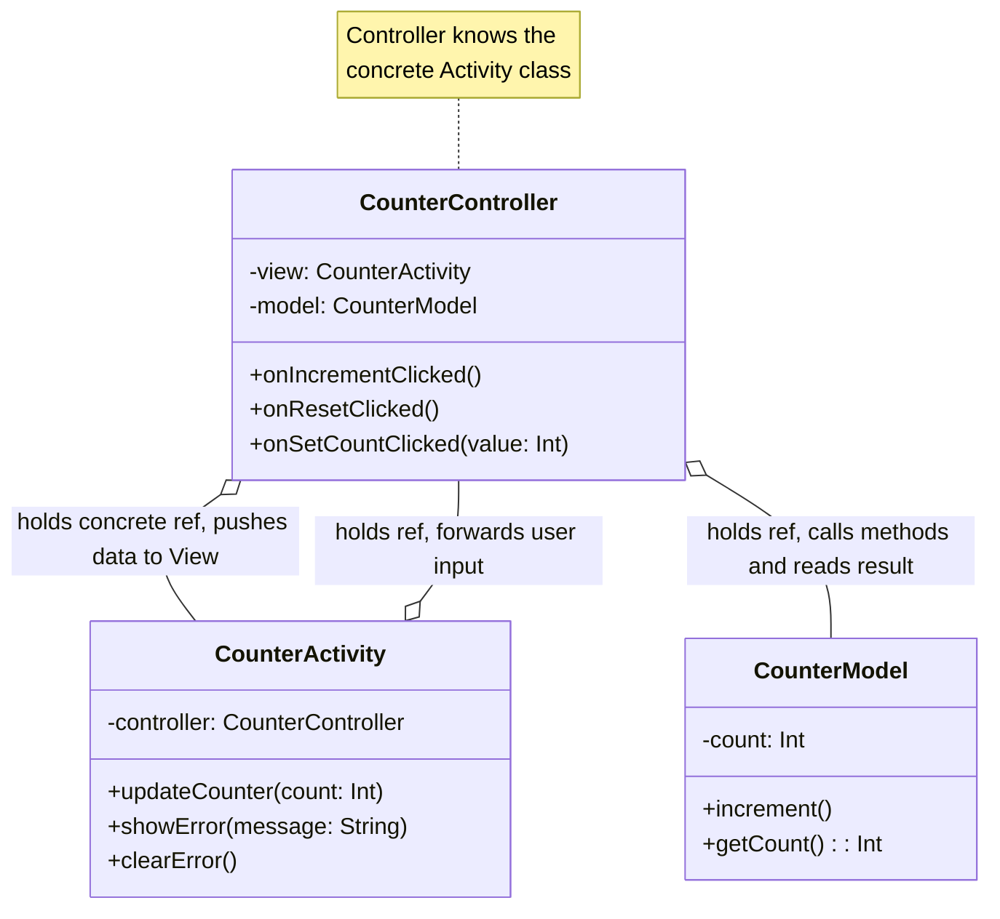
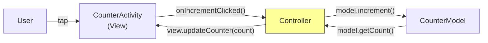
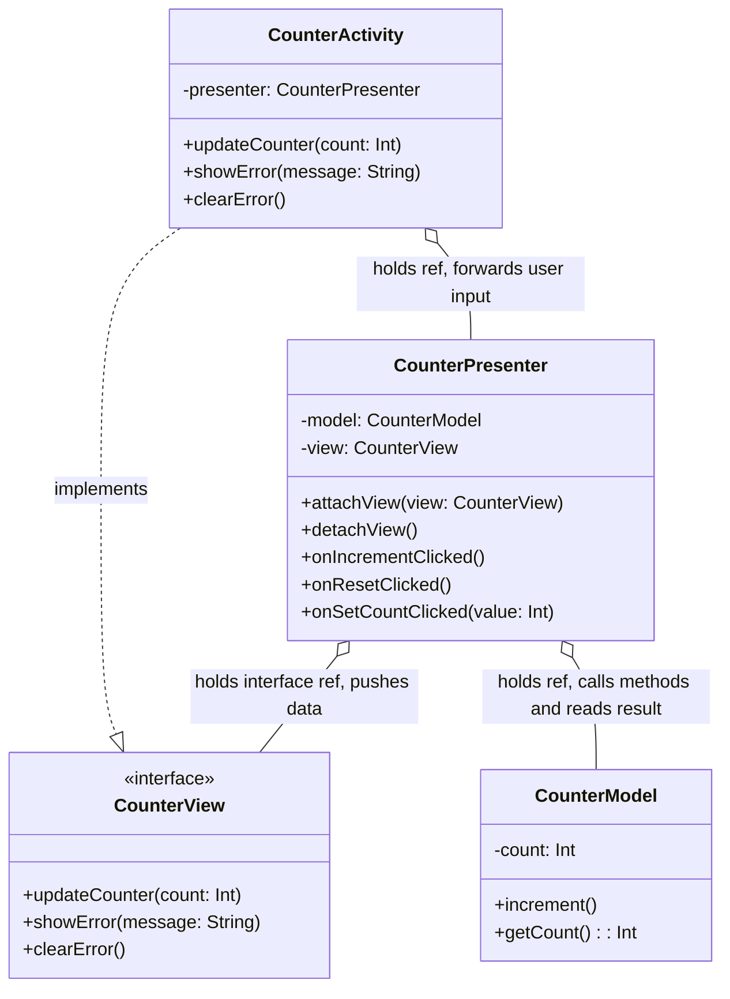
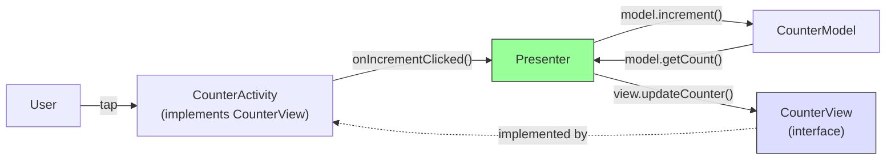
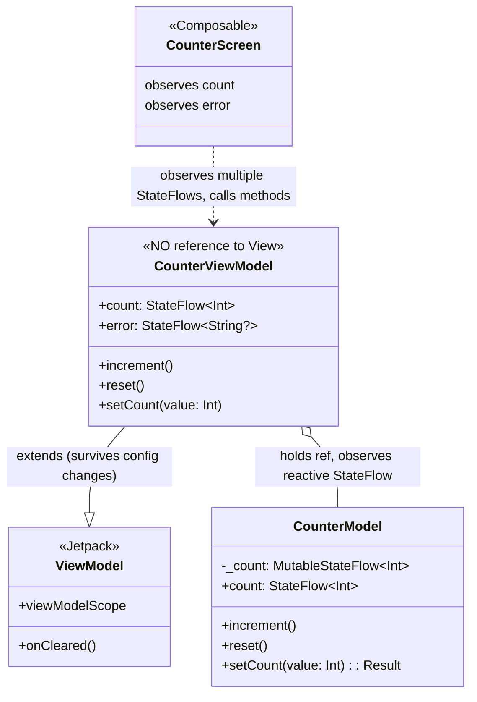
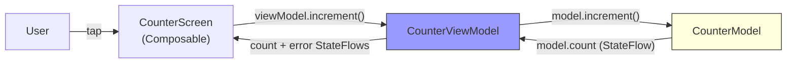
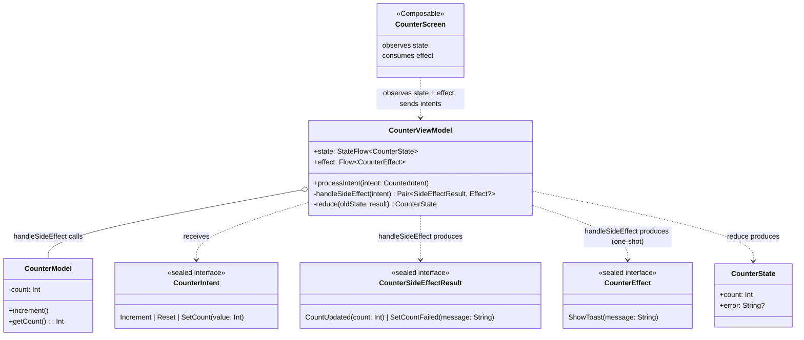
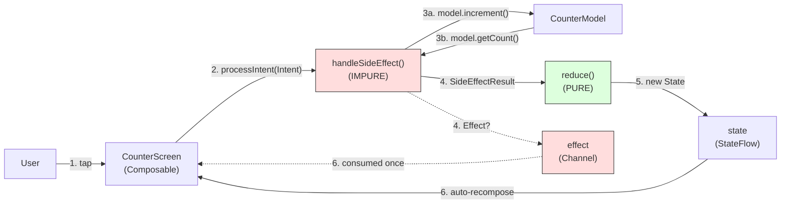
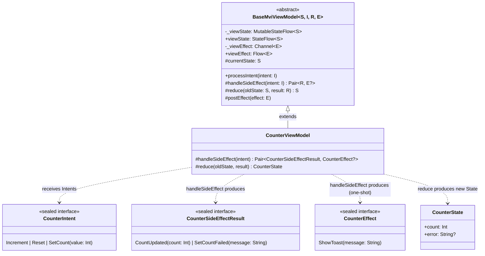
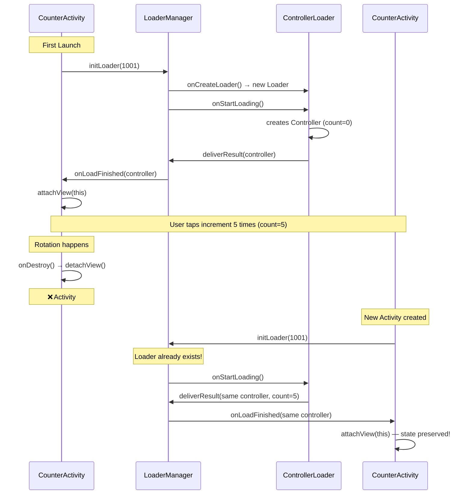

# The Evolution of Android UI Architecture Patterns: UI-Centric vs MVC vs MVP vs MVVM vs MVI

Modern Android development stands on the shoulders of many architectural patterns. Each one emerged to address problems of the previous approach, especially around **coupling** between UI and logic and **managing state** across lifecycle events. This article traces that evolution step-by-step, illustrating how Android developers moved from **“everything in the Activity”** to more decoupled, testable patterns.


> **Note:** Each pattern (especially MVC) has many variants across platforms and
> communities. The versions shown here reflect common Android implementations.
> For example, MVC in Android (where the Controller references the Activity
> directly) differs from the original Smalltalk-80 MVC (where the View observes
> the Model directly) and from Web MVC (Rails, Spring). The core ideas are the
> same, but the wiring details vary. This article focuses on the Android variants
> to show a clear evolutionary path.

> **Code samples:** Import statements are omitted for brevity. The full,
> compilable source for each pattern is in the
> [companion repository](https://github.com/kayzhang/android-architecture-patterns)
> — one branch per pattern.

## 1. The Early Days: UI-Centric (God Activity)

> 📁 [Full source: `pattern/no-pattern`](https://github.com/kayzhang/android-architecture-patterns/tree/pattern/no-pattern)

### What It Is

Early Android apps often threw **all** logic — business logic, UI updates, and state management into one `Activity` or `Fragment`. This was sometimes erroneously labeled “MVC,” but in practice, there was **no** separate Controller file. Everything lived in the same UI class, leading to “God Activities.”

### Example (Counter App)
**MainActivity.kt**

```kotlin
class MainActivity : AppCompatActivity() {

    // Data — lives right here in the Activity
    private var count = 0

    // Business logic — also in the Activity (not in a separate Model)
    private fun setCount(value: Int): Boolean {
        return if (value >= 0) {
            count = value
            true
        } else {
            false
        }
    }

    override fun onCreate(savedInstanceState: Bundle?) {
        super.onCreate(savedInstanceState)
        setContentView(R.layout.activity_main)

        val countTextView = findViewById<TextView>(R.id.countTextView)
        val errorTextView = findViewById<TextView>(R.id.errorTextView)

        // Notice: increment bypasses setCount's validation entirely —
        // a typical bug in God Activities where there's no enforced path
        // for data changes.
        findViewById<Button>(R.id.incrementButton).setOnClickListener {
            count++                                    // data mutation in UI
            countTextView.text = count.toString()      // UI update
            errorTextView.visibility = View.GONE
        }

        findViewById<Button>(R.id.resetButton).setOnClickListener {
            count = 0                                  // data mutation in UI
            countTextView.text = count.toString()      // UI update
            errorTextView.visibility = View.GONE
        }

        findViewById<Button>(R.id.setToNeg1Button).setOnClickListener {
            if (setCount(-1)) {
                countTextView.text = count.toString()
                errorTextView.visibility = View.GONE
            } else {
                errorTextView.text = "Negative counts not allowed"
                errorTextView.visibility = View.VISIBLE
            }
        }
    }
}
```

### Shortcomings

*   **Tight Coupling**: The UI class owns everything — difficult to expand or test.
*   **Difficult Testing**: All logic is in an `Activity` that depends on Android framework code.
*   **State Loss**: Rotations recreate the `Activity`, losing the `count` unless you manually handle it.
*   **No Separation of Concerns**: Business logic and UI code are interwoven.

## 2. Classic MVC: Introducing a Separate Controller

> 📁 [Full source: `pattern/mvc`](https://github.com/kayzhang/android-architecture-patterns/tree/pattern/mvc)

**Model–View–Controller** (MVC) is the next step. Instead of dumping everything in the `Activity`, we introduce a dedicated controller class that sits between the UI and the data Model. The Activity (or `Fragment`) still represents the **View**, but we now have:

*   A **Model** (e.g., `CounterModel`) to hold data and operations.
*   A **Controller** that orchestrates data retrieval/updates.
*   The **View** (the `Activity`) that renders the data and forwards user input.

The `Activity` serves as the View, while a distinct `Controller` class references both the View and the Model. This is a step up from the UI-centric approach: at least we have a separate logic class.


#### Class Diagram



#### Data Flow



### Base MVC Example

**CounterModel.kt**

```kotlin
// Model
class CounterModel {
    private var count = 0

    fun increment() { count++ }
    fun reset() { count = 0 }

    fun setCount(value: Int): Result<Unit> {
        return if (value >= 0) {
            count = value
            Result.success(Unit)
        } else {
            Result.failure(IllegalArgumentException("Negative counts not allowed"))
        }
    }

    fun getCount(): Int = count
}
```

**CounterController.kt**

```kotlin
// The "Controller" references a concrete Activity as the View
class CounterController(
    private val view: CounterActivity, // Direct link to Activity (the View)
    private val model: CounterModel
) {
    fun onIncrementClicked() {
        model.increment()
        view.updateCounter(model.getCount())
        view.clearError()
    }

    fun onResetClicked() {
        model.reset()
        view.updateCounter(model.getCount())
        view.clearError()
    }

    fun onSetCountClicked(value: Int) {
        model.setCount(value)
            .onSuccess {
                view.updateCounter(model.getCount())
                view.clearError()
            }
            .onFailure { e ->
                view.showError(e.message ?: "Error")
            }
    }
}
```

**CounterActivity.kt**

```kotlin
// The Activity as "View"
class CounterActivity : AppCompatActivity() {

    private lateinit var controller: CounterController
    private lateinit var countTextView: TextView
    private lateinit var errorTextView: TextView

    override fun onCreate(savedInstanceState: Bundle?) {
        super.onCreate(savedInstanceState)
        setContentView(R.layout.activity_counter)

        countTextView = findViewById(R.id.countTextView)
        errorTextView = findViewById(R.id.errorTextView)

        val model = CounterModel()
        controller = CounterController(this, model)

        findViewById<Button>(R.id.incrementButton).setOnClickListener {
            controller.onIncrementClicked()
        }
        findViewById<Button>(R.id.resetButton).setOnClickListener {
            controller.onResetClicked()
        }
        findViewById<Button>(R.id.setToNeg1Button).setOnClickListener {
            controller.onSetCountClicked(-1)
        }
    }

    fun updateCounter(count: Int) {
        countTextView.text = count.toString()
    }

    fun showError(message: String) {
        errorTextView.text = message
        errorTextView.visibility = View.VISIBLE
    }

    fun clearError() {
        errorTextView.text = ""
        errorTextView.visibility = View.GONE
    }
}
```

**This basic MVC setup has two immediate problems:**

1. **State loss on configuration changes:** Model and Controller are both created in `onCreate()`. When the Activity is destroyed and recreated (e.g. on rotation), `onCreate()` runs again, creating a fresh Model and Controller — the count resets to 0.

2. **Tight coupling:** The Controller holds a direct reference to the concrete `CounterActivity` class. This makes it impossible to unit test the Controller without the Android runtime, and the Controller can't work with any other View implementation.

> **Note on MVC variants:** The version shown here is the Android-community MVC where
> the Controller mediates everything — the Model never talks to the View. In the
> original Smalltalk-80 MVC, the Model can notify the View directly via an observer
> pattern, meaning data can reach the View through multiple paths (Model → View AND
> Controller → View). This matters later when we compare MVC to MVP — one of MVP's
> advantages is eliminating that direct Model → View path.

Before `ViewModel` existed, developers used **Loaders** (or retained Fragments) to keep the Controller alive across rotations. This solved the state loss problem but added significant boilerplate. See [Appendix: MVC with Loaders](#appendix-mvc-with-loaders) for the full implementation.

### Why MVC Is Still Limited

*   **Strong Coupling to Lifecycle:** Even with approaches like Loaders to retain the Controller, it requires the Activity to call `attachView()` / `detachView()` at the right lifecycle moments. Forget one? Memory leak or stale UI. This manual lifecycle contract is error-prone.
*   **Testing Challenges:** Retaining the Controller via Loaders ties it to the Android framework, making pure unit testing cumbersome.
*   **Boilerplate:** Retaining the Controller across rotations requires extra infrastructure (Loaders or retained Fragments), a View interface, and careful attach/detach lifecycle management — a non-trivial amount of code for a simple problem.

## 3. MVP: Breaking the Direct Coupling with a View Interface

> 📁 [Full source: `pattern/mvp`](https://github.com/kayzhang/android-architecture-patterns/tree/pattern/mvp)


**Model–View–Presenter** (MVP) emerged as a response to the coupling issue in classic MVC. Instead of referencing the concrete `Activity` or `Fragment` as the View, the Presenter only knows a **View interface**. That interface is then implemented by the `Activity`. This effectively breaks the direct link between the Presenter and an Android class.


#### Class Diagram



#### Data Flow



### Base MVP Example

**CounterModel.kt** (same as MVC)

```kotlin
// Model
class CounterModel {
    private var count = 0

    fun increment() { count++ }
    fun reset() { count = 0 }

    fun setCount(value: Int): Result<Unit> {
        return if (value >= 0) {
            count = value
            Result.success(Unit)
        } else {
            Result.failure(IllegalArgumentException("Negative counts not allowed"))
        }
    }

    fun getCount(): Int = count
}
```

**CounterView.kt** (the interface — key difference from MVC)

```kotlin
// View Interface
interface CounterView {
    fun updateCounter(count: Int)
    fun showError(message: String)
    fun clearError()
}
```

**CounterPresenter.kt**

```kotlin
// Presenter
class CounterPresenter(private val model: CounterModel) {

    private var view: CounterView? = null  // nullable — View can be detached

    // Note: In this example the Presenter is NOT retained — it's recreated on
    // every rotation, just like MVC. The attachView/detachView structure exists
    // so it COULD be retained (e.g., via a Loader) if needed. MVVM makes this
    // automatic.
    fun attachView(view: CounterView) {
        this.view = view
        view.updateCounter(model.getCount())  // sync View with current state
    }

    fun detachView() {
        this.view = null  // prevents memory leak of old Activity
    }

    fun onIncrementClicked() {
        model.increment()
        view?.updateCounter(model.getCount())
        view?.clearError()
    }

    fun onResetClicked() {
        model.reset()
        view?.updateCounter(model.getCount())
        view?.clearError()
    }

    fun onSetCountClicked(value: Int) {
        model.setCount(value)
            .onSuccess {
                view?.updateCounter(model.getCount())
                view?.clearError()
            }
            .onFailure { e ->
                view?.showError(e.message ?: "Error")
            }
    }
}
```

**CounterActivity.kt** (implements CounterView)

```kotlin
// Activity implementing the View interface
class CounterActivity : AppCompatActivity(), CounterView {

    private lateinit var presenter: CounterPresenter
    private lateinit var countTextView: TextView
    private lateinit var errorTextView: TextView

    override fun onCreate(savedInstanceState: Bundle?) {
        super.onCreate(savedInstanceState)
        setContentView(R.layout.activity_counter)

        countTextView = findViewById(R.id.countTextView)
        errorTextView = findViewById(R.id.errorTextView)

        presenter = CounterPresenter(CounterModel())
        presenter.attachView(this)  // connect Presenter to this Activity

        findViewById<Button>(R.id.incrementButton).setOnClickListener {
            presenter.onIncrementClicked()
        }
        findViewById<Button>(R.id.resetButton).setOnClickListener {
            presenter.onResetClicked()
        }
        findViewById<Button>(R.id.setToNeg1Button).setOnClickListener {
            presenter.onSetCountClicked(-1)
        }
    }

    override fun onDestroy() {
        super.onDestroy()
        presenter.detachView()  // disconnect to prevent leak if Presenter were retained
    }

    override fun updateCounter(count: Int) {
        countTextView.text = count.toString()
    }

    override fun showError(message: String) {
        errorTextView.text = message
        errorTextView.visibility = View.VISIBLE
    }

    override fun clearError() {
        errorTextView.text = ""
        errorTextView.visibility = View.GONE
    }
}
```

> *A similar Loader-based rotation fix could be applied to MVP (see [Appendix: MVC with Loaders](#appendix-mvc-with-loaders)); developers would have historically done something similar if they needed to retain the Presenter across configuration changes.*

### Why MVP Is Better Than Classic MVC

1.  **Coupling direction:** In MVC, the Controller references a concrete Activity. In MVP, the Presenter references an interface (`CounterView`). This is what makes the Presenter unit-testable — you can substitute a mock or fake without the Android runtime.
2.  **Data flow paths:** In some MVC variants (e.g., Smalltalk-80), the Model can notify the View directly — data reaches the View through multiple paths. MVP eliminates this by making the Presenter the sole path for updating the UI.
3.  **Lifecycle readiness:** The Presenter’s `attachView`/`detachView` structure exists so it CAN be retained across configuration changes. This is what MVVM later makes automatic with `ViewModel`.

## 4. MVVM: Achieving Full UI Isolation with Reactive Streams

> 📁 [Full source: `pattern/mvvm`](https://github.com/kayzhang/android-architecture-patterns/tree/pattern/mvvm)

### Reactive Programming

Before explaining MVVM, it helps to understand **reactive programming** — a general concept not specific to Android.

In all the patterns so far (MVC, MVP), data updates are **imperative** — someone explicitly pushes data to the View:

```kotlin
// Imperative (MVC/MVP): you push data to the View explicitly
view.updateCounter(model.getCount())  // Presenter/Controller decides WHEN to update
```

In **reactive** programming, the View **subscribes** to state — and gets notified automatically whenever it changes. No one pushes; the change propagates on its own:

```kotlin
// Reactive: View subscribes, gets notified automatically
viewModel.count.collect { count ->         // XML Views era: reactive observation...
    textView.text = count.toString()       // ...but still imperative rendering
}

// Fully reactive (Compose era): observation AND rendering are both automatic
val count by viewModel.count.collectAsState()
Text(text = count.toString())   // Compose re-renders automatically
```

The core of reactive is **automatic change propagation** — the View doesn’t need to be told when to update. The reactive concept predates mobile development — from spreadsheets (1979) to the Observer pattern (1994) to RxJava (2013) to Compose (2021). On Android, the evolution was `RxJava.subscribe` → `LiveData.observe` → `StateFlow.collect` → `collectAsStateWithLifecycle`. See the [Appendix: Reactive Programming History](#appendix-reactive-programming-history) for the full timeline.

### The MVVM Concept

**MVVM (Model-View-ViewModel)** applies reactive programming to architecture. Instead of the Presenter pushing data to the View (MVP), the ViewModel holds data in a **reactive** manner and the View **subscribes and observes** that data. The ViewModel doesn’t push to the View; the View listens on its own. This means the ViewModel is totally UI-agnostic — it has no references to Activity or Fragment.

**What MVVM IS:**
*   The View observes the ViewModel’s reactive state and re-renders when it changes
*   The ViewModel exposes state and methods but has ZERO reference to the View
*   User actions flow one way (View → ViewModel), state flows the other way (ViewModel → View) — this is called **unidirectional data flow**

**What MVVM is NOT:**
*   MVVM is NOT about surviving configuration changes — that’s a framework feature (Jetpack’s `ViewModel` class), not the pattern itself. A plain class acting as a ViewModel would still be destroyed on rotation, just like MVP’s Presenter.
*   MVVM is NOT a specific tool — you can implement it with RxJava, LiveData, StateFlow, or any reactive mechanism.

### MVVM on Android

Here’s how each MVVM role is filled on Android:

**The Model** — a plain Kotlin class (or Repository), same concept as MVC/MVP. In standard MVVM, the Model is reactive — it exposes `StateFlow` so the ViewModel can observe data changes directly instead of manually syncing. In our code, `CounterModel` exposes `val count: StateFlow<Int>`.

**The ViewModel** — a class YOU write that holds reactive state (`StateFlow`) internally, exposes it publicly for the View to observe, and provides methods for user actions. The reactive state uses `StateFlow` (Kotlin-native, always holds a current value, the current standard — replacing `LiveData` and RxJava). The ViewModel has ZERO reference to the View — it doesn’t know or care who’s observing.

**The View** — observes the ViewModel’s `StateFlow` and renders the UI. How the View connects to the ViewModel differs by era:

*   **XML Views (older):** `viewModel.count.collect { textView.text = it.toString() }` — reactive observation, but imperative UI update (you manually set the widget's text inside the callback).
*   **Jetpack Compose (current):** `val count by viewModel.count.collectAsStateWithLifecycle()` — reactive end-to-end: observation is reactive AND the UI auto-recomposes when state changes. `collectAsStateWithLifecycle()` is also lifecycle-aware: it pauses when the app is in the background and resumes when visible.

The View calls ViewModel methods for user actions (`viewModel.increment()`), and observes ViewModel’s StateFlow for state. This is the **unidirectional data flow** described earlier — actions always flow one way (View → ViewModel), state always flows the other (ViewModel → View):

*   **User action** → View calls ViewModel method
*   **ViewModel** updates its `StateFlow`
*   **View** observes the change and automatically re-renders

That’s MVVM — Model, ViewModel, View, connected reactively. But there’s a gap: a plain Kotlin class acting as ViewModel would be destroyed on configuration changes, just like MVP’s Presenter.

### Jetpack’s ViewModel Class

**Jetpack’s `ViewModel` class** (`androidx.lifecycle.ViewModel`) fills this gap. It does NOT provide the MVVM role — that’s the reactive state + methods described above. It adds **framework features** on top:

*   **Configuration change survival** — Android stores it in a hidden retained container (`ViewModelStore`) that is NOT destroyed during configuration changes. When the new Activity is created after rotation, it reconnects to the same `ViewModelStore` and gets the same `ViewModel` instance back — with all its state intact. Same concept as Loader, but zero boilerplate.
*   **`viewModelScope`** — a coroutine scope for async operations, auto-cancelled when cleared. Not used in our counter, but essential in real apps.
*   **No manual lifecycle management** — no `attachView()` / `detachView()`.

> *__What about process death?__ `ViewModel` survives configuration changes (rotation, theme switch) but NOT process death — when Android kills the app in the background to reclaim memory, the `ViewModel` and all its state are gone. For state that must survive process death, use `SavedStateHandle` (a key-value map persisted by the framework) or persist to disk (Room, DataStore). In our counter example this doesn't matter, but in a real app you'd save critical UI state like scroll position or form input via `SavedStateHandle`.*

> *“ViewModel” means two things: (1) the **pattern role** described above (reactive state + methods), and (2) the **Jetpack class** that adds config change survival. Our code does both: we write the MVVM role AND extend the Jetpack class.*

> *__But isn’t extending an Android class a coupling problem?__ The Jetpack `ViewModel` class doesn’t require any Android objects (Activity, Context, View) to construct or use. In production, the framework creates it via `ViewModelProvider` (XML Views) or the `viewModel()` helper (Compose), looking it up in the `ViewModelStore`. In tests, you skip the framework and just instantiate it: `val vm = CounterViewModel()`. It remains fully unit-testable, just like MVP’s Presenter.*

### Example (Using StateFlow + Jetpack Compose)

#### Class Diagram



#### Data Flow



**CounterModel.kt** (reactive — exposes StateFlow)

```kotlin
// Model
class CounterModel {

    private val _count = MutableStateFlow(0)

    // Observable count — in a real app, this would be a Room DAO Flow.
    val count: StateFlow<Int> = _count.asStateFlow()

    // Use update {} for atomic read-modify-write.
    // _count.value++ is non-atomic — two concurrent callers could lose an update.
    // update {} retries on CAS (Compare-And-Swap) failure, guaranteeing correctness.
    fun increment() { _count.update { it + 1 } }

    // Direct assignment is safe here — the new value (0) doesn't depend
    // on the current state, so there's no lost-update race.
    fun reset() { _count.value = 0 }

    fun setCount(value: Int): Result<Unit> {
        return if (value >= 0) {
            _count.value = value
            Result.success(Unit)
        } else {
            Result.failure(IllegalArgumentException("Negative counts not allowed"))
        }
    }
}
```

**CounterViewModel.kt**

```kotlin
// ViewModel
class CounterViewModel : ViewModel() {

    private val model = CounterModel()

    val count: StateFlow<Int> = model.count

    private val _error = MutableStateFlow<String?>(null)
    val error: StateFlow<String?> = _error.asStateFlow()

    fun increment() {
        model.increment()
        _error.value = null
        // No need to sync count — model.count StateFlow already updated
    }

    fun reset() {
        model.reset()
        _error.value = null
    }

    fun setCount(value: Int) {
        model.setCount(value)
            .onSuccess { _error.value = null }
            .onFailure { e -> _error.value = e.message }
    }
}
```

> *__Note:__ In a real app, the `CounterModel` (or Repository) would be injected via Hilt or Koin rather than instantiated directly in the ViewModel. We create it inline here for simplicity. Injecting dependencies makes the ViewModel easier to test with mock data sources.*

**CounterScreen.kt** (Composable View)

```kotlin
// View
@Composable
fun CounterScreen(
    modifier: Modifier = Modifier,
    viewModel: CounterViewModel = viewModel()
) {
    val count by viewModel.count.collectAsStateWithLifecycle()
    val error by viewModel.error.collectAsStateWithLifecycle()

    CounterContent(
        count = count,
        error = error,
        onIncrement = viewModel::increment,
        onReset = viewModel::reset,
        onSetCount = viewModel::setCount,
        modifier = modifier
    )
}

@Composable
private fun CounterContent(
    count: Int,
    error: String?,
    onIncrement: () -> Unit,
    onReset: () -> Unit,
    onSetCount: (Int) -> Unit,
    modifier: Modifier = Modifier
) {
    Column(
        modifier = modifier
            .fillMaxSize()
            .padding(16.dp),
        horizontalAlignment = Alignment.CenterHorizontally,
        verticalArrangement = Arrangement.Center
    ) {
        Text(
            text = count.toString(),
            style = MaterialTheme.typography.displayLarge
        )

        error?.let {
            Spacer(modifier = Modifier.height(8.dp))
            Text(text = it, color = Color.Red)
        }

        Spacer(modifier = Modifier.height(24.dp))

        Button(onClick = onIncrement) {
            Text("+1")
        }

        Spacer(modifier = Modifier.height(8.dp))

        Button(onClick = onReset) {
            Text("Reset")
        }

        Spacer(modifier = Modifier.height(8.dp))

        Button(onClick = { onSetCount(-1) }) {
            Text("Set to -1 (error)")
        }
    }
}
```

> _**Note on `collectAsStateWithLifecycle()`:** This is the recommended API from the `androidx.lifecycle:lifecycle-runtime-compose` library._
> 
> _Unlike the basic `collectAsState()`, it automatically pauses collection when the UI goes to the background, avoiding unnecessary work and potential resource leaks. Prefer it over `collectAsState()` in all Compose + lifecycle-aware contexts._

### Key Points

*   **No View reference at all:** The ViewModel never calls `view.updateCounter()` or holds any View type. MVP’s Presenter still held a `CounterView` interface.
*   **Survives Configuration Changes:** The Jetpack `ViewModel` class is retained across config changes by default, eliminating the need for Loaders, retained Fragments, or manual `attachView`/`detachView`.
*   **Completely UI-Agnostic:** The UI subscribes to state changes via `StateFlow`, making the ViewModel trivial to unit test — just check StateFlow values, no mock View needed.
*   **Unidirectional Data Flow:** Actions flow one way (View → ViewModel), state flows the other (ViewModel → View). No tangled two-way references like MVC.
*   **Reactive instead of imperative:** The View observes state changes instead of being pushed to. Miss a push call in MVP = stale UI. In MVVM, if the state changes, the UI updates — you can’t forget.

> *__Note:__ Strictly speaking, configuration change survival is a Jetpack framework feature, not part of the MVVM pattern itself. But in Android development, the two are inseparable — Android developers always extend Jetpack’s `ViewModel` class when writing the MVVM role, so when they say “MVVM” they typically assume config change survival comes with it — even though that’s the framework, not the pattern. This effectively replaced the need for Loaders in modern architectures.*

### Why MVVM Replaced MVP

By combining lifecycle-awareness and reactive updates, MVVM eliminates the boilerplate needed for rotation handling and keeps business logic fully decoupled from the UI.

*   The UI knows about the `ViewModel`, but the `ViewModel` knows absolutely nothing about the UI.
*   With reactive programming, the `ViewModel` communicates back to the View via observables (e.g., `StateFlow`, `LiveData`, or RxJava) — no imperative push calls.
*   The Jetpack `ViewModel` class survives configuration changes automatically, replacing Loaders and the manual `attachView`/`detachView` lifecycle.
*   Unlike iOS, where the ViewModel is often just a plain class, in Android the ViewModel extends the Jetpack `ViewModel` base class. This means it survives configuration changes automatically — the framework retains it when the Activity is recreated, and only destroys it when the Activity is truly finished.

**What’s still not ideal (leads to MVI):**

*   State is spread across multiple StateFlows (`count`, `error`) — no single “screen state” object
*   Any method can update any StateFlow — no single path for all state changes
*   No exhaustive list of user actions — adding a new ViewModel method doesn’t force you to handle it anywhere

## 5. MVI: Enforcing Unidirectional Data Flow

> _**Naming Note:** In MVI, "Intent" refers to a user action or event. It has nothing to do with Android's `android.content.Intent` class. In a project that uses both, you will want to use fully qualified names or type aliases to avoid confusion._

### Why MVI?

*   **Unidirectional Data Flow:** ALL state changes go through Intent → Side Effect → SideEffectResult → Reducer → State. No scattered updates, no multiple paths.
*   **Single Source of Truth:** One `State` object represents the entire screen. No multiple StateFlows to check.
*   **Explicit Intent Handling:** Every user action is a typed `Intent` (sealed class). The compiler forces you to handle every one — add a new Intent, forget to handle it, compile error.
*   **Predictable:** Given the same State + Intent, the state change follows a single, traceable path. Easy to debug, easy to test. In our implementation, we go further by separating the reducer from side effects — making the reducer a pure function `(State, SideEffectResult) → State` — but this separation is a best practice, not an MVI requirement.
*   **Compose Synergy:** Jetpack Compose is reactive and declarative — feeding it a single MVI State object is a natural fit.

### What It Is

MVI (Model-View-Intent) is a specialization or extension of MVVM that enforces a strict unidirectional data flow with explicit user Intents. The user triggers `Intent` objects, which a side effect handler processes (mutating the Model, calling APIs, etc.) to produce `SideEffectResult` objects. Those results are then fed into a **pure reducer** that maps `(State, SideEffectResult) → new State`. The UI observes that `State`, re-rendering accordingly.

The key separation is:
*   **`handleSideEffect()`** — IMPURE: executes side effects and returns a `SideEffectResult`
*   **`reduce()`** — PURE: maps `(State, SideEffectResult) → State` with no side effects

> _**"Side effect" terminology:** Here, "side effect" means any impure operation — model mutations, API calls, database writes. This is the functional programming meaning. It is unrelated to Compose's `SideEffect` and `LaunchedEffect` composables, which are lifecycle-aware effect handlers for running code in response to composition._

In simpler forms, MVI can look similar to MVVM with a single data class for `State` and a single sealed interface for `Intents`. In more advanced, "**Redux-like**" forms, we add a reusable base class that enforces the pattern via abstract methods, ensuring consistency across a large codebase.

### 5.1 Lightweight MVI Approach

> 📁 [Full source: `pattern/mvi-lightweight`](https://github.com/kayzhang/android-architecture-patterns/tree/pattern/mvi-lightweight)

Below is a lightweight MVI example implemented using separate files for State, Intent, Model, ViewModel, and Screen:

#### Class Diagram



#### Data Flow



**CounterModel.kt** (plain class — MVI doesn't need reactive Model)

```kotlin
// Model
// Unlike MVVM's Model (which is reactive and exposes StateFlow), MVI's Model
// does NOT need to be reactive. The side effect handler calls the Model
// imperatively (model.getCount()) and produces a SideEffectResult that the
// pure reducer maps into new state.
class CounterModel {
    private var count = 0

    fun increment() { count++ }
    fun reset() { count = 0 }

    fun setCount(value: Int): Result<Unit> {
        return if (value >= 0) {
            count = value
            Result.success(Unit)
        } else {
            Result.failure(IllegalArgumentException("Negative counts not allowed"))
        }
    }

    fun getCount(): Int = count
}
```

**CounterEffect.kt** (one-shot events)

```kotlin
// Effects: One-off events
sealed interface CounterEffect {
    data class ShowToast(val message: String) : CounterEffect
    // e.g., data object NavigateToDetail : CounterEffect
}
```

**CounterState.kt + CounterIntent.kt + CounterSideEffectResult.kt**

```kotlin
// CounterState.kt
// State: Single source of truth for the UI
data class CounterState(
    val count: Int = 0,
    val error: String? = null
)

// CounterIntent.kt
// Intents: All possible user actions
// Note: "Intent" here is an MVI concept - unrelated to android.content.Intent
sealed interface CounterIntent {
    data object Increment : CounterIntent
    data object Reset : CounterIntent
    data class SetCount(val value: Int) : CounterIntent
}

// CounterSideEffectResult.kt
// SideEffectResults: What HAPPENED after executing a side effect.
// The reducer only sees these, never raw Intents — keeping it pure.
sealed interface CounterSideEffectResult {
    data class CountUpdated(val count: Int) : CounterSideEffectResult
    data class SetCountFailed(val message: String) : CounterSideEffectResult
}
```

**CounterViewModel.kt**

```kotlin
// ViewModel in MVI style — pure reducer, side effects separated
class CounterViewModel : ViewModel() {

    private val model = CounterModel()

    private val _state = MutableStateFlow(CounterState())
    val state: StateFlow<CounterState> = _state.asStateFlow()

    // Channel ensures effects are consumed exactly once and not dropped
    // if emitted while the UI is briefly in the background.
    private val _effect = Channel<CounterEffect>(capacity = Channel.BUFFERED)
    val effect: Flow<CounterEffect> = _effect.receiveAsFlow()

    fun processIntent(intent: CounterIntent) {
        val (result, effect) = handleSideEffect(intent)
        _state.update { oldState -> reduce(oldState, result) }
        effect?.let { postEffect(it) }
    }

    /**
     * Pure reducer: (State, SideEffectResult) → State.
     * No side effects, no model calls. Same input always produces same output.
     */
    private fun reduce(
        oldState: CounterState,
        result: CounterSideEffectResult
    ): CounterState =
        when (result) {
            is CounterSideEffectResult.CountUpdated ->
                oldState.copy(count = result.count, error = null)

            is CounterSideEffectResult.SetCountFailed ->
                oldState.copy(error = result.message)
        }

    /**
     * Side effect handler: (Intent) → (SideEffectResult, Effect?).
     * IMPURE — mutates the Model and produces a SideEffectResult for the reducer,
     * plus an optional one-shot Effect for the UI.
     */
    private fun handleSideEffect(
        intent: CounterIntent
    ): Pair<CounterSideEffectResult, CounterEffect?> =
        when (intent) {
            is CounterIntent.Increment -> {
                model.increment()
                CounterSideEffectResult.CountUpdated(model.getCount()) to null
            }

            is CounterIntent.Reset -> {
                model.reset()
                CounterSideEffectResult.CountUpdated(model.getCount()) to null
            }

            is CounterIntent.SetCount -> {
                model.setCount(intent.value).fold(
                    onSuccess = {
                        CounterSideEffectResult.CountUpdated(model.getCount()) to null
                    },
                    onFailure = { e ->
                        CounterSideEffectResult.SetCountFailed(e.message ?: "Error") to
                            CounterEffect.ShowToast(e.message ?: "Error")
                    }
                )
            }
        }

    private fun postEffect(effect: CounterEffect) {
        viewModelScope.launch {
            _effect.send(effect)
        }
    }
}
```

> _**Note on threading:** `processIntent` and `handleSideEffect` run synchronously on the calling thread (typically the main thread). This is fine for in-memory operations like our counter, but in a real app with network or database calls, you would launch a coroutine in `handleSideEffect` (using `viewModelScope`) and emit results asynchronously._

**CounterScreen.kt** (Composable View)

```kotlin
// Composable "View" observing StateFlow + consuming one-shot Effects
@Composable
fun CounterScreen(
    modifier: Modifier = Modifier,
    viewModel: CounterViewModel = viewModel()
) {
    val state by viewModel.state.collectAsStateWithLifecycle()

    // Collect one-shot effects (toast, navigation)
    val context = LocalContext.current
    val lifecycleOwner = LocalLifecycleOwner.current
    LaunchedEffect(viewModel.effect, lifecycleOwner) {
        lifecycleOwner.lifecycle.repeatOnLifecycle(Lifecycle.State.STARTED) {
            viewModel.effect.collect { effect ->
                when (effect) {
                    is CounterEffect.ShowToast ->
                        Toast.makeText(context, effect.message, Toast.LENGTH_SHORT).show()
                }
            }
        }
    }

    CounterContent(
        state = state,
        onIntent = viewModel::processIntent,
        modifier = modifier
    )
}

@Composable
private fun CounterContent(
    state: CounterState,
    onIntent: (CounterIntent) -> Unit,
    modifier: Modifier = Modifier
) {
    Column(
        modifier = modifier
            .fillMaxSize()
            .padding(16.dp),
        horizontalAlignment = Alignment.CenterHorizontally,
        verticalArrangement = Arrangement.Center
    ) {
        Text(
            text = state.count.toString(),
            style = MaterialTheme.typography.displayLarge
        )

        state.error?.let { error ->
            Spacer(modifier = Modifier.height(8.dp))
            Text(text = error, color = Color.Red)
        }

        Spacer(modifier = Modifier.height(24.dp))

        Button(onClick = { onIntent(CounterIntent.Increment) }) {
            Text("+1")
        }

        Spacer(modifier = Modifier.height(8.dp))

        Button(onClick = { onIntent(CounterIntent.Reset) }) {
            Text("Reset")
        }

        Spacer(modifier = Modifier.height(8.dp))

        Button(onClick = { onIntent(CounterIntent.SetCount(-1)) }) {
            Text("Set to -1 (error + toast)")
        }
    }
}
```

#### Where Does the Reducer Go?

**In simple MVI, the "Reducer" is a private function** that maps `(State, SideEffectResult) → State`. It's pure — no side effects, no model calls. The impure work (model mutations) happens in `handleSideEffect()`, which produces the `SideEffectResult` the reducer consumes. This separation means the reducer is trivially testable: given the same inputs, it always returns the same output.

### 5.2 A Redux-like MVI Flavor with BaseViewModel Approach

> 📁 [Full source: `pattern/mvi-redux`](https://github.com/kayzhang/android-architecture-patterns/tree/pattern/mvi-redux)

The lightweight MVI above covers the core pattern. If you’ve worked with Redux in JavaScript, you’ll notice parallels. Even if not, think of it as a clear pipeline for user actions → state changes.

For larger apps, a more structured “Redux-like” approach adds reusable infrastructure on top.

#### Why Go "Redux-Like"?

The lightweight MVI above already gives you sealed Intents, single State, a pure reducer, and one-shot Effects. The Redux-like version adds structure for **scaling to complex apps**:

*   **`BaseMviViewModel<S, I, R, E>`** — a reusable generic base class so every screen follows the same pattern. No need to re-implement `StateFlow` + `Channel` + `processIntent` boilerplate per screen.
*   **Enforced pattern via abstract methods** — `handleSideEffect()` and `reduce()` are abstract, so the side effect / pure reducer split is mandatory and consistent across the team. In lightweight MVI this split is a convention (private methods); in Redux-like it’s compiler-enforced.

If your app has simple screens, lightweight MVI is enough. Redux-like is for when you need consistency across many screens and want the base class to enforce the pattern.

#### Class Diagram



#### Data Flow

The data flow is identical to lightweight MVI (Section 5.1). The only difference is structural: the base class provides `processIntent()`, and the child ViewModel implements `handleSideEffect()` and `reduce()` as abstract methods instead of private ones.

#### 5.2.1 Structuring the Code with a Base ViewModel

In more complex apps, each screen defines its own State, Intent, SideEffectResult, and Effect. To avoid duplicating the StateFlow + Channel + processIntent boilerplate, create a `BaseMviViewModel`:

**BaseMviViewModel.kt** (in `core/mvi/`)

```kotlin
abstract class BaseMviViewModel<S, I, R, E>(
    initialState: S
) : ViewModel() {

    private val _viewState = MutableStateFlow(initialState)
    val viewState: StateFlow<S> = _viewState.asStateFlow()

    // Channel ensures effects are consumed exactly once and not dropped
    // if emitted while the UI is briefly in the background.
    private val _viewEffect = Channel<E>(capacity = Channel.BUFFERED)
    val viewEffect: Flow<E> = _viewEffect.receiveAsFlow()

    protected val currentState: S
        get() = _viewState.value

    /**
     * Single entry point for all user actions.
     *
     * 1. handleSideEffect() executes impure logic and produces a SideEffectResult + optional Effect
     * 2. reduce() purely maps (oldState + result) into newState
     * 3. Effect (if any) is emitted to the Channel for one-shot UI consumption
     */
    fun processIntent(intent: I) {
        val (result, effect) = handleSideEffect(intent)
        _viewState.update { oldState -> reduce(oldState, result) }
        effect?.let { postEffect(it) }
    }

    /**
     * Side effect handler — IMPURE.
     * Executes Model mutations, API calls, etc. and returns a SideEffectResult
     * plus an optional one-shot Effect.
     */
    protected abstract fun handleSideEffect(intent: I): Pair<R, E?>

    /**
     * Pure reducer: (State, SideEffectResult) → State.
     * No side effects. Same input always produces the same output.
     */
    protected abstract fun reduce(oldState: S, result: R): S

    protected fun postEffect(effect: E) {
        viewModelScope.launch {
            _viewEffect.send(effect)
        }
    }
}
```

**How It Works:**

*   `viewState` is the single source of truth for the screen.
*   `viewEffect` handles one-shot events (toast, navigation) via Channel — consumed exactly once.
*   `processIntent()` is the single entry point for all user actions.
*   `handleSideEffect()` is the impure function each child ViewModel implements: `(intent) → (sideEffectResult, effect?)`.
*   `reduce()` is the pure function each child ViewModel implements: `(oldState, sideEffectResult) → newState`.

> _**Thread-safety note:** `processIntent` is not thread-safe for concurrent calls. While `_viewState.update` is atomic, `handleSideEffect` mutates the Model imperatively — two concurrent calls could corrupt Model state. For a production base class, you would process intents sequentially through a `Channel` or protect shared state with a `Mutex`._

#### 5.2.2 Defining State, Intents, SideEffectResults, and Effects

The type definitions are identical to lightweight MVI (Section 5.1): `CounterState`, `CounterIntent`, `CounterSideEffectResult`, and `CounterEffect`. The only difference is structural — in the Redux-like version, these types are consumed by abstract methods on `BaseMviViewModel` rather than private methods inline.

#### 5.2.3 The Redux-Like ViewModel

The ViewModel implements `handleSideEffect()` and `reduce()` — everything else comes from the base class:

**CounterViewModel.kt**

```kotlin
class CounterViewModel : BaseMviViewModel<CounterState, CounterIntent, CounterSideEffectResult, CounterEffect>(
    initialState = CounterState()
) {
    private val model = CounterModel()

    /**
     * Side effect handler — IMPURE.
     * Mutates the Model and returns a SideEffectResult for the reducer,
     * plus an optional one-shot Effect for the UI.
     */
    override fun handleSideEffect(
        intent: CounterIntent
    ): Pair<CounterSideEffectResult, CounterEffect?> =
        when (intent) {
            is CounterIntent.Increment -> {
                model.increment()
                CounterSideEffectResult.CountUpdated(model.getCount()) to null
            }

            is CounterIntent.Reset -> {
                model.reset()
                CounterSideEffectResult.CountUpdated(model.getCount()) to null
            }

            is CounterIntent.SetCount -> {
                model.setCount(intent.value).fold(
                    onSuccess = {
                        CounterSideEffectResult.CountUpdated(model.getCount()) to null
                    },
                    onFailure = { e ->
                        CounterSideEffectResult.SetCountFailed(e.message ?: "Error") to
                            CounterEffect.ShowToast(e.message ?: "Error")
                    }
                )
            }
        }

    /**
     * Pure reducer: (State, SideEffectResult) → State.
     * No side effects, no model calls. Same input always produces same output.
     */
    override fun reduce(
        oldState: CounterState,
        result: CounterSideEffectResult
    ): CounterState =
        when (result) {
            is CounterSideEffectResult.CountUpdated ->
                oldState.copy(count = result.count, error = null)

            is CounterSideEffectResult.SetCountFailed ->
                oldState.copy(error = result.message)
        }
}
```

`handleSideEffect` returns `Pair(sideEffectResult, effect?)`: the result goes to the pure reducer, the effect goes to `Channel` (one-shot).

#### 5.2.4 Consuming the Redux-Like ViewModel in Compose

The View observes **two things**: `viewState` (persistent state) and `viewEffect` (one-shot events):

**CounterScreen.kt**

```kotlin
@Composable
fun CounterScreen(
    modifier: Modifier = Modifier,
    viewModel: CounterViewModel = viewModel()
) {
    // Pattern 1: State — reactive, auto-recomposes
    val state by viewModel.viewState.collectAsStateWithLifecycle()

    // Pattern 2: Effect — one-shot, consumed once, lifecycle-aware
    val context = LocalContext.current
    val lifecycleOwner = LocalLifecycleOwner.current
    LaunchedEffect(viewModel.viewEffect, lifecycleOwner) {
        lifecycleOwner.lifecycle.repeatOnLifecycle(Lifecycle.State.STARTED) {
            viewModel.viewEffect.collect { effect ->
                when (effect) {
                    is CounterEffect.ShowToast ->
                        Toast.makeText(context, effect.message, Toast.LENGTH_SHORT).show()
                }
            }
        }
    }

    CounterContent(
        state = state,
        onIntent = viewModel::processIntent,
        modifier = modifier
    )
}

// Stateless content — doesn't know about ViewModel, just renders parameters
@Composable
private fun CounterContent(
    state: CounterState,
    onIntent: (CounterIntent) -> Unit,
    modifier: Modifier = Modifier
) {
    Column(
        modifier = modifier
            .fillMaxSize()
            .padding(16.dp),
        horizontalAlignment = Alignment.CenterHorizontally,
        verticalArrangement = Arrangement.Center
    ) {
        Text(
            text = state.count.toString(),
            style = MaterialTheme.typography.displayLarge
        )

        state.error?.let { error ->
            Spacer(modifier = Modifier.height(8.dp))
            Text(text = error, color = Color.Red)
        }

        Spacer(modifier = Modifier.height(24.dp))

        Button(onClick = { onIntent(CounterIntent.Increment) }) {
            Text("+1")
        }

        Spacer(modifier = Modifier.height(8.dp))

        Button(onClick = { onIntent(CounterIntent.Reset) }) {
            Text("Reset")
        }

        Spacer(modifier = Modifier.height(8.dp))

        Button(onClick = { onIntent(CounterIntent.SetCount(-1)) }) {
            Text("Set to -1 (error + toast)")
        }
    }
}
```

*   `viewState` recomposes automatically when the state changes.
*   `processIntent(...)` is the single path to change state.
*   `viewEffect` delivers one-shot events like `ShowToast` exactly once via the `repeatOnLifecycle` block.

### 5.3 Comparing MVI Approaches

| | **Lightweight** | **Redux-like** |
|---|---|---|
| **Boilerplate** | Low — all logic inline in one ViewModel | Higher — base class + type parameters |
| **Pattern enforcement** | Convention (private methods) | Compiler-enforced (abstract methods) |
| **Team consistency** | Each developer structures it differently | Every screen follows the same shape |
| **Testing** | Test through `processIntent` | Same |
| **Best for** | Small apps, solo developers, simple screens | Large teams, many screens, complex flows |

Both share the same runtime flow, types (`State`, `Intent`, `SideEffectResult`, `Effect`), and pure reducer separation. The choice is about how much structure you want enforced.

## Conclusion

Android’s architectural evolution reflects a consistent push toward loose coupling, testability, and robust state management:

*   **UI-Centric** lumps everything into one place (the “God Activity”), making code fragile and hard to test.
*   **Classic MVC** separates logic from UI but still references the Activity directly in the Controller. Loaders helped preserve logic but added significant boilerplate, and care must be taken to re-attach the new Activity reference after rotation.
*   **MVP** introduces a View interface, decoupling the Presenter from concrete UI classes; Loaders (or retained Fragments) again offered a rotation fix pre-ViewModel.
*   **MVVM** introduces reactive data streams — the UI subscribes to the ViewModel’s state instead of being pushed to, fully isolating business logic from UI code. Jetpack Compose makes this end-to-end reactive with automatic recomposition, and Jetpack’s `ViewModel` class retains state across configuration changes, eliminating the need for Loaders.
*   **MVI** enforces unidirectional data flow structurally via sealed Intents, a single State object, and a single entry point (`processIntent`). In our implementation, we separate side effects from a pure reducer — a best practice that makes state transitions deterministic and testable.

MVI can be **lightweight** (all logic inline in one ViewModel) or **Redux-like** (a reusable base class that enforces the pattern via abstract methods). Both emphasize a single source of truth and an explicit path for state changes. In modern projects, many teams favor **MVVM** or **MVI** — often with Jetpack Compose — for clarity, testability, and a lifecycle-friendly structure.

## Appendix: MVC with Loaders

> 📁 [Full source: `pattern/mvc-loader`](https://github.com/kayzhang/android-architecture-patterns/tree/pattern/mvc-loader)

Before Jetpack's `ViewModel` existed, developers used **Loaders** to retain the Controller across configuration changes. A Loader is a uniquely identified companion object (identified by an integer ID) that the system keeps alive and reconnects to the Activity after each rotation. This closely imitates how `ViewModel` itself would later work.


### Loader Rotation Flow



### Adding a Loader to Retain the Controller

> **_Important caveat:_**_After a rotation,_ `_LoaderManager_` _reattaches the same_ `_CounterController_` _instance (_**but that controller still holds a reference to the destroyed Activity**_)._
> 
> _The code below demonstrates the technique and shows the critical extra step required: re-attaching the new Activity to the retained controller via_ `_attachView(this)_` _in_ `_onLoadFinished_`_._
> 
> _Without this, the controller would call UI methods on a dead Activity._

```kotlin
// 1) The Controller now uses a view interface so it can be re-attached
interface CounterView {
    fun updateCounter(count: Int)
    fun showError(message: String)
    fun clearError()
}

class CounterController(private val model: CounterModel) {
    private var view: CounterView? = null

    // Track the last error so it can be restored after rotation.
    // The Model holds the count, but error state is UI-level —
    // the Controller must track it separately.
    private var lastError: String? = null

    fun attachView(view: CounterView) {
        this.view = view
        // Sync the new View with the full current state
        view.updateCounter(model.getCount())
        if (lastError != null) {
            view.showError(lastError!!)
        } else {
            view.clearError()
        }
    }

    fun detachView() {
        this.view = null
    }

    fun onIncrementClicked() {
        model.increment()
        lastError = null
        view?.updateCounter(model.getCount())
        view?.clearError()
    }

    fun onResetClicked() {
        model.reset()
        lastError = null
        view?.updateCounter(model.getCount())
        view?.clearError()
    }

    fun onSetCountClicked(value: Int) {
        model.setCount(value)
            .onSuccess {
                lastError = null
                view?.updateCounter(model.getCount())
                view?.clearError()
            }
            .onFailure { e ->
                lastError = e.message
                view?.showError(e.message ?: "Error")
            }
    }
}

// 2) Create a Loader to hold the Controller
class ControllerLoader(
    context: Context
) : Loader<CounterController>(context) {

    private var controller: CounterController? = null

    override fun onStartLoading() {
        if (controller == null) {
            val model = CounterModel()
            controller = CounterController(model)
        }
        controller?.let { deliverResult(it) }
    }
}

// 3) Activity: Using the Loader to persist the Controller
class CounterActivity : AppCompatActivity(), CounterView {
    companion object {
        private const val LOADER_ID = 1001
    }

    private var controller: CounterController? = null
    private lateinit var countTextView: TextView
    private lateinit var errorTextView: TextView

    private val loaderCallbacks = object : LoaderManager.LoaderCallbacks<CounterController> {
        override fun onCreateLoader(id: Int, args: Bundle?): Loader<CounterController> {
            return ControllerLoader(this@CounterActivity)
        }

        override fun onLoadFinished(loader: Loader<CounterController>, data: CounterController?) {
            // CRITICAL: always re-attach the new Activity instance to the retained Controller.
            // Without this, the Controller still holds a reference to the destroyed Activity
            // and any UI calls would either silently do nothing or crash.
            controller = data
            controller?.attachView(this@CounterActivity)
        }

        override fun onLoaderReset(loader: Loader<CounterController>) {
            controller?.detachView()
            controller = null
        }
    }

    override fun onCreate(savedInstanceState: Bundle?) {
        super.onCreate(savedInstanceState)
        setContentView(R.layout.activity_counter)

        countTextView = findViewById(R.id.countTextView)
        errorTextView = findViewById(R.id.errorTextView)

        // Use the AndroidX LoaderManager API (not the deprecated Activity.loaderManager property)
        LoaderManager.getInstance(this).initLoader(LOADER_ID, null, loaderCallbacks)

        findViewById<Button>(R.id.incrementButton).setOnClickListener {
            controller?.onIncrementClicked()
        }
        findViewById<Button>(R.id.resetButton).setOnClickListener {
            controller?.onResetClicked()
        }
        findViewById<Button>(R.id.setToNeg1Button).setOnClickListener {
            controller?.onSetCountClicked(-1)
        }
    }

    override fun onDestroy() {
        super.onDestroy()
        // Detach the view to avoid leaking this Activity instance while the
        // Loader (and Controller) continue to live in the background.
        controller?.detachView()
    }

    override fun updateCounter(count: Int) {
        countTextView.text = count.toString()
    }

    override fun showError(message: String) {
        errorTextView.text = message
        errorTextView.visibility = View.VISIBLE
    }

    override fun clearError() {
        errorTextView.text = ""
        errorTextView.visibility = View.GONE
    }
}
```

**How It Works**:

*   `ControllerLoader` is responsible for creating and holding onto the `CounterController`.
*   On rotation, `LoaderManager` reattaches the same loader, so the same `CounterController` instance is retained.
*   `onLoadFinished` re-attaches the _new_ Activity instance to the retained controller, ensuring UI calls are never routed to a destroyed Activity.
*   `attachView()` syncs the new View with the full current state — both the count (from the Model) and the error message (tracked separately by the Controller via `lastError`).
*   `onDestroy` calls `detachView()` so the Controller doesn't hold a leaked reference while the Activity is being torn down.
*   The result is an MVC setup that can survive rotations — including error state — albeit with significant boilerplate.

## Appendix: Reactive Programming History

The reactive concept predates mobile development. The idea of "declare a relationship, changes propagate automatically" goes back to **spreadsheets** (1979, VisiCalc), was formalized as the **Observer pattern** (1994, Gang of Four), extended into chainable data streams by Microsoft’s **Reactive Extensions** (2009), and made mainstream for UI by Facebook’s **React** (2013):

*   **Spreadsheets** (1979, VisiCalc) — the earliest mainstream reactive system: change cell A1, cell B1 auto-updates
*   **Observer pattern** (1994, Gang of Four) — formalized "subscribe and notify" in software design — the same pattern used in the MVC Loader section earlier
*   **Reactive Extensions / Rx** (2009, Microsoft) — extended the Observer pattern into chainable data streams (filter, transform, combine), later ported to Java as RxJava (2013)
*   **React / React Native** (2013/2015, Facebook) — made reactive UI mainstream for web and mobile
*   **SwiftUI** (2019, Apple) — reactive UI for iOS/macOS
*   **Jetpack Compose** (2021, Google) — reactive UI for Android

Under the hood, all reactive tools are built on the Observer pattern — subscribe and get notified when data changes. The evolution on Android is about making this safer and more automatic: `RxJava.subscribe` (2013, powerful but complex) → `LiveData.observe` (2017, lifecycle-aware) → `StateFlow.collect` (2020, Kotlin-native) → `collectAsStateWithLifecycle` (2021, Compose + lifecycle-aware).

On Android specifically, the reactive story evolved in two phases:
1.  **Reactive observation** (2013–2020): The View could subscribe to data changes (RxJava → LiveData → StateFlow), but the rendering was still imperative — inside the callback you manually set `textView.text = ...`.
2.  **Reactive end-to-end** (2021+): Jetpack Compose made the rendering reactive too — you declare `Text(count.toString())` and Compose re-renders automatically. No imperative widget updates anywhere.

## Further Reading

* [The Evolution of Android Architecture Patterns: UI-Centric vs MVC vs MVP vs MVVM vs MVI](https://proandroiddev.com/the-evolution-of-android-architecture-patterns-from-ui-centric-to-mvc-to-mvp-to-mvvm-to-mvi-ea811518ff49)
* [Guide to app architecture](https://developer.android.com/topic/architecture)
* [MVI — The Good, the Bad, and the Ugly](https://adambennett.dev/2019/07/mvi-the-good-the-bad-and-the-ugly/)
* [A robust MVI implementation with Jetpack Compose](https://medium.com/proandroiddev/a-robust-mvi-with-jetpack-compose-e08882d2c4ff)